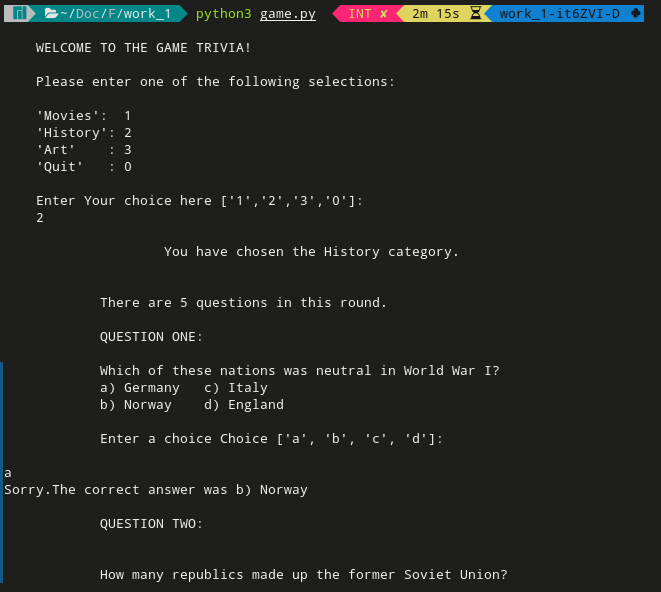

# How to run this program

The program is called game.py and to run it you shall just run the following command.

If you are on linux/macbook.

```
python3 game.py
```

If you are on windows.
```
python game.py
```

Make sure to have  <code>python 3.6+</code> or higher versions. 

The welcome screen to this game looks as below.



From there the game carries on. ENJOY THE TRIVIA GAME.